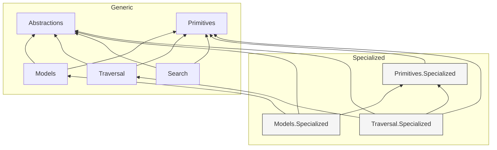

# System Patterns

## Architecture Overview

Arborescence follows a layered architecture with clearly separated concerns. The architecture can be visualized as follows:

## Key Technical Decisions

### Layered Design

The system follows a clear layering pattern:
1. **Abstractions**: Foundation layer with interfaces and conceptual definitions
2. **Primitives**: Low-level data structures and utilities
3. **Models**: Graph data model implementations
4. **Traversal & Search**: Algorithms built on top of the lower layers

### Specialization Pattern

- Core packages provide general-purpose implementations
- Specialized packages optimize for specific use cases or performance
- Specialized implementations depend on both abstractions and their general-purpose counterparts

### Dependency Direction

- Higher-level modules depend on lower-level ones
- Abstractions do not depend on concrete implementations
- Specialized implementations depend on their general counterparts

## Component Relationships

### Graph Data Structure Components

- **Adjacency vs. Incidence**: The library appears to support both adjacency list and incidence list representations
- **Vertices & Edges**: Primitives define basic vertex and edge concepts
- **Collections**: Specialized collections for efficient graph operations

### Algorithm Components

- **Traversal**: BFS, DFS implementations with various strategies (Eager, Enumerable, Recursive)
- **Search**: Path-finding algorithms likely built on traversal foundations
- **Handlers**: Callback-based processing for vertices and edges during traversal
