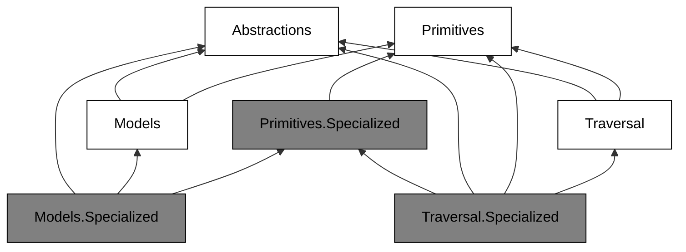

# Product Overview

Arborescence is a generic .NET library of graph data structures and algorithms.
The interfaces stay data-structure-agnostic, so a caller keeps its own graph representation.

## Packages

Every package name carries the `Arborescence.` prefix.

- **Abstractions** — interfaces and concepts for examining graphs and collections.
- **Primitives** — building blocks for data structures and APIs.
- **Models** — generic graph structures that implement the interfaces.
- **Traversal** — BFS and DFS.
- **Search** — Dijkstra; preview.
- **Primitives.Specialized**, **Models.Specialized**, **Traversal.Specialized** — `Int32` counterparts of the base package, for vertices and keys from a contiguous range.

